# Auto-Analyst Application Flow Diagram

## Function Call Flow

This diagram represents how the various functions in `app.py` work together to process user requests and generate responses.

```mermaid
graph TD
    %% Main entry points
    A[FastAPI App] --> B["/chat/{agent_name}" Endpoint]
    A --> C["/chat" Endpoint]
    A --> D["/api/analyze-file" Endpoint]
    A --> E[Other Endpoints]

    %% Chat with agent endpoint flow
    B --> F["chat_with_agent()"]
    F --> G["_update_session_from_query_params()"]
    F --> H["_validate_agent_name()"]
    F --> I["_prepare_query_with_context()"]
    F --> J["auto_analyst_ind(agents=[...])"]
    J --> K["format_response_to_markdown()"]
    F --> L["_track_model_usage()"]

    %% Chat with all endpoint flow
    C --> M["chat_with_all()"]
    M --> G
    M --> N["get_session_lm()"]
    M --> O["_generate_streaming_responses()"]
    O --> P["session_state[ai_system].get_plan()"]
    O --> Q["_execute_plan_with_timeout()"]
    O --> R["format_response_to_markdown()"]
    O --> S["_estimate_tokens()"]
    O --> T["_create_usage_record()"]

    %% Analyze file endpoint flow
    D --> U["analyze_file()"]
    U --> V["load_dataset_from_file_server()"]
    U --> W["create_analysis_prompt()"]
    U --> X["query_gemini()"]
    U --> L

    %% Session and Model Management
    Z[AppState] --> AA["SessionManager"]
    Z --> AB["AI_Manager"]
    N --> AC["create_fallback_lm()"]

    %% File Server Integration
    V --> AD["datasets_cache"]
    AD --> AE["requests to FILE_SERVER_URL"]

    %% Agent and Plan Execution
    Q --> AF["ai_system.execute_plan()"]
    AF --> AG["Specialized Agents"]
    AG --> AH["data_viz_agent"]
    AG --> AI["sk_learn_agent"]
    AG --> AJ["statistical_analytics_agent"]
    AG --> AK["preprocessing_agent"]

    %% Planning System
    P --> AL["PLANNER_AGENTS"]
    AL --> AM["planner_preprocessing_agent"]
    AL --> AN["planner_sk_learn_agent"]
    AL --> AO["planner_statistical_analytics_agent"]
    AL --> AP["planner_data_viz_agent"]

    %% Error Handling and Tracking
    F --> BA["Error Handling"]
    M --> BA
    U --> BA
    BA --> BB["logger.log_message()"]

    %% Setup and Initialization
    A --> CA["load_dotenv()"]
    A --> CB["initialize_retrievers()"]
    A --> CC["AVAILABLE_AGENTS Dictionary"]
    A --> CD["PLANNER_AGENTS Dictionary"]
    A --> CE["Middleware Configuration"]
```

## Key Process Flows

### 1. User Query Processing Flow

When a user submits a query to the `/chat` endpoint:

1. The request is received by the `chat_with_all()` function
2. Session parameters are extracted and validated
3. The appropriate language model is retrieved using `get_session_lm()`
4. A streaming response is initiated with `_generate_streaming_responses()`
5. The AI system generates a plan using the query and available data
6. The plan is executed through multiple specialized agents
7. Results are formatted and streamed back to the user
8. Usage statistics are tracked for billing and analytics

### 2. Direct Agent Query Flow

When a user submits a query to a specific agent via `/chat/{agent_name}`:

1. The request is received by the `chat_with_agent()` function 
2. The agent name is validated against available agents
3. The query is enhanced with conversation context
4. The specified agent processes the query and generates a response
5. The response is formatted and returned to the user
6. Usage statistics are tracked

### 3. File Analysis Flow

When a user requests analysis of an uploaded file via `/api/analyze-file`:

1. The request is received by the `analyze_file()` function
2. The specified file is loaded from the file server
3. An enhanced analysis prompt is created based on the data
4. The prompt is sent to an AI model for processing
5. The AI response is formatted and returned to the user
6. Usage statistics are tracked 