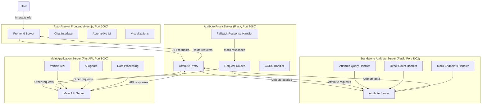
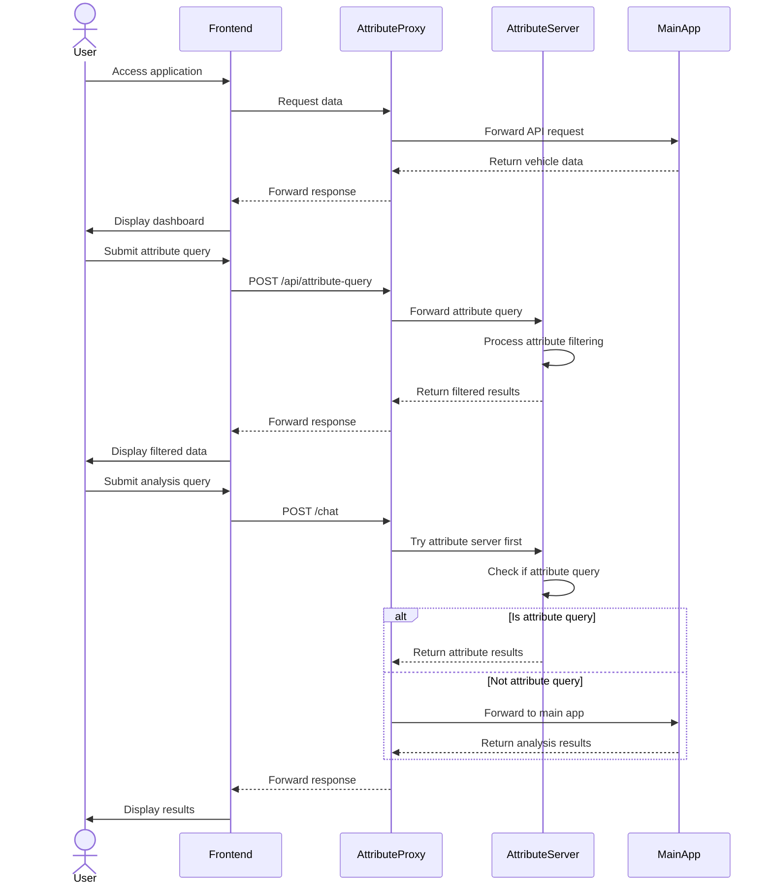

# Auto-Analyst Architecture

This document provides an overview of the Auto-Analyst application architecture, including component interactions and data flow diagrams.

## System Overview

Auto-Analyst is a full-stack web application for data analysis with a focus on automotive pricing intelligence. It consists of four main components:

1. **Frontend**: Next.js application running on port 3000
2. **Attribute Proxy Server**: Flask server running on port 8080
3. **Standalone Attribute Server**: Flask server running on port 8002
4. **Main Application Server**: FastAPI server running on port 8000 (optional)

The application provides a UI for data visualization, conversational interface for data queries, and AI-powered analysis tools.

## Architecture Diagram



## Component Details

### Frontend (Next.js)

The frontend is structured as a Next.js application with the following key components:

- **App Directory**: Contains page routes and layouts
  - `/app/chat`: Chat interface for data analysis
  - `/app/automotive`: Automotive data analysis interface
  - `/app/api`: API routes for server-side operations

- **Components Directory**: Reusable React components
  - `/components/chat`: Chat interface components
  - `/components/automotive`: Automotive data visualization components
  - `/components/ui`: UI components from shadcn/ui

- **Config Directory**: Configuration files
  - `api.ts`: API endpoint configuration

### Attribute Proxy Server (Flask)

The attribute proxy server runs on port 8080 and intelligently routes requests between the frontend and backend servers:

- **Endpoints**:
  - `/health`: Health check endpoint
  - `/chat`: Chat proxy (tries attribute server first)
  - `/api/attribute-query`: Attribute query proxy
  - `/api/direct-count`: Direct count proxy
  - `/*`: Proxy for all other endpoints

- **Core Functionality**:
  - Routes attribute queries to the standalone attribute server
  - Forwards other requests to the main application server
  - Provides fallback responses when backends are unavailable
  - Handles CORS and connection issues transparently

### Standalone Attribute Server (Flask)

The standalone attribute server runs on port 8002 and provides efficient attribute filtering without heavy dependencies:

- **Endpoints**:
  - `/health`: Health check endpoint
  - `/api/attribute-query`: Detects and processes attribute queries
  - `/api/direct-count`: Direct counting by attribute name and value
  - `/api/chat-attribute`: Chat integration for attribute queries
  - `/model`: Get available models
  - `/model-settings`: Get model settings
  - `/agents`: Get available agents
  - `/api/session-info`: Get session info

- **Core Functionality**:
  - Provides zero-dependency attribute filtering
  - Handles vehicle counting by color, make, model, year, etc.
  - Serves mock endpoints for model settings and agents
  - Works without NumPy/pandas to avoid compatibility issues

### Main Application Server (FastAPI)

The main application server runs on port 8000 and provides advanced AI features:

- **Endpoints**:
  - `/api/vehicles`: Vehicle inventory data
  - `/api/market-data`: Market analysis data
  - `/api/opportunities`: Market opportunities
  - `/api/statistics`: Statistical analysis
  - `/health`: Health check endpoint

- **Core Functionality**:
  - Provides LLM-powered chat and analysis features
  - Handles complex data processing and visualization
  - Serves the primary API endpoints for vehicles and statistics
  - Optional component that may have NumPy compatibility issues in some environments

## Data Flow Diagram



## Data Model

The Auto-Analyst system works with the following key data entities:

### Vehicle Inventory

```json
{
  "id": "integer",
  "make": "string",
  "model": "string",
  "year": "integer",
  "color": "string",
  "price": "float",
  "mileage": "integer",
  "condition": "string",
  "fuel_type": "string",
  "days_in_inventory": "integer",
  "vin": "string",
  "is_sold": "boolean"
}
```

### Market Data

```json
{
  "id": "integer",
  "make": "string",
  "model": "string",
  "year": "integer",
  "your_price": "float",
  "market_price": "float",
  "price_difference": "float",
  "price_difference_percent": "float",
  "days_in_inventory": "integer",
  "market_demand": "string",
  "avg_days_to_sell": "integer"
}
```

### Opportunities

```json
{
  "id": "integer",
  "make": "string",
  "model": "string",
  "year": "integer",
  "your_price": "float",
  "market_price": "float",
  "price_difference": "float",
  "price_difference_percent": "float",
  "days_in_inventory": "integer",
  "potential_profit": "float"
}
```

## Technologies Used

- **Frontend**:
  - Next.js 13.5.11
  - React
  - TypeScript
  - Tailwind CSS
  - shadcn/ui components
  - Plotly.js (for visualizations)

- **Backend**:
  - Python 3.11+
  - Flask (for Attribute Server and Proxy)
  - FastAPI (for Main Application Server)
  - CSV parsing libraries

## Deployment Considerations

- The application is designed to run locally with the following services:
  - Frontend server on port 3000
  - Attribute proxy server on port 8080
  - Standalone attribute server on port 8002
  - Main application server on port 8000 (optional)

- For production deployment, consider:
  - Containerizing the services using Docker
  - Implementing proper authentication
  - Setting up a reverse proxy (like Nginx)
  - Configuring CORS properly for all services

## Error Handling and Resilience

The system implements error handling at multiple levels:

1. **Frontend**:
   - Graceful degradation with fallback displays
   - User-friendly error messages
   - CORS bypass for attribute server communication
   - Network timeout detection and retries

2. **Attribute Proxy**:
   - Routes requests intelligently based on availability
   - Provides mock responses when backends are unavailable
   - Handles CORS issues transparently

3. **Standalone Attribute Server**:
   - Zero-dependency implementation to avoid compatibility issues
   - Simple CSV parsing without NumPy/pandas dependencies
   - Mock endpoints for UI compatibility

4. **Main Application Server**:
   - Try-except blocks for robust operation
   - Standardized error responses
   - Logging for system monitoring

## Recent Updates

- Fixed TypeScript errors in the PlotlyMessage interface
- Enhanced the PlotlyChart component with better error handling
- Corrected file upload issues in the handleFileUpload function
- Improved CSV parsing in the file_server.py
- Enhanced the generateFallbackResponse function for better visualization support 