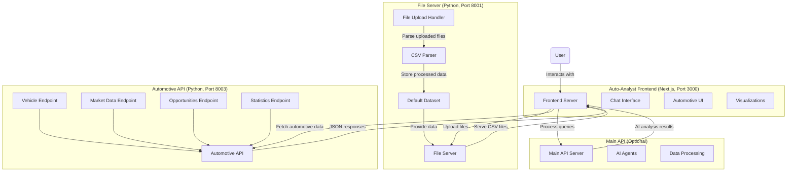
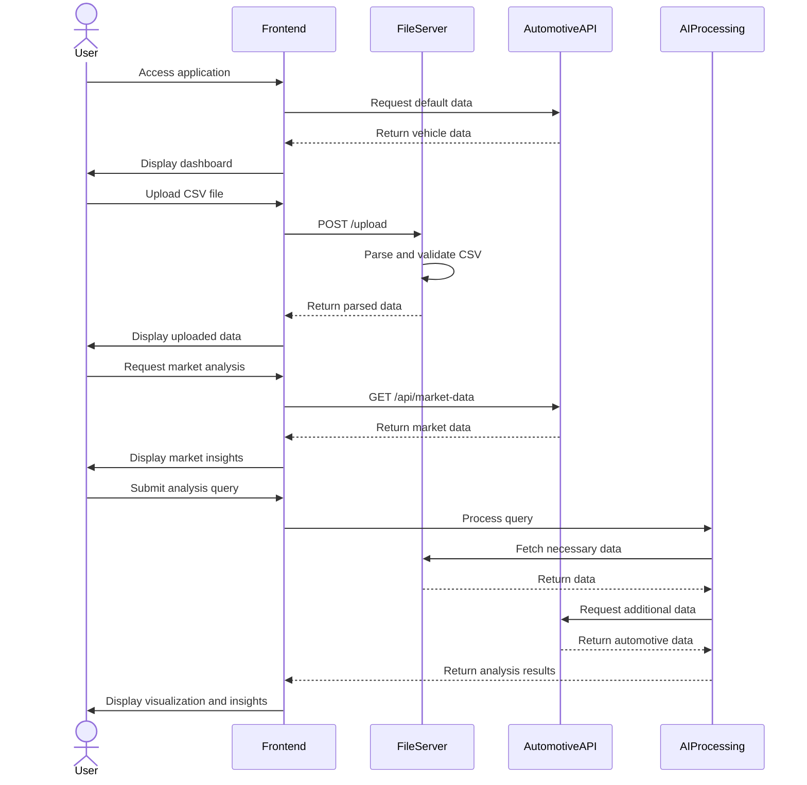

# Auto-Analyst Architecture

This document provides an overview of the Auto-Analyst application architecture, including component interactions and data flow diagrams.

## System Overview

Auto-Analyst is a full-stack web application for data analysis with a focus on automotive pricing intelligence. It consists of three main components:

1. **Frontend**: Next.js application running on port 3000
2. **File Server**: Python HTTP server running on port 8001
3. **Automotive API Server**: Python HTTP server running on port 8003

The application provides a UI for data visualization, file uploads, and interaction with AI-powered analysis tools.

## Architecture Diagram



## Component Details

### Frontend (Next.js)

The frontend is structured as a Next.js application with the following key components:

- **App Directory**: Contains page routes and layouts
  - `/app/chat`: Chat interface for data analysis
  - `/app/automotive`: Automotive data analysis interface
  - `/app/api`: API routes for server-side operations

- **Components Directory**: Reusable React components
  - `/components/chat`: Chat interface components
  - `/components/automotive`: Automotive data visualization components
  - `/components/ui`: UI components from shadcn/ui

- **Config Directory**: Configuration files
  - `api.ts`: API endpoint configuration

### File Server (Python)

The file server runs on port 8001 and handles file uploads, storage, and retrieval:

- **Endpoints**:
  - `/health`: Health check endpoint
  - `/exports/<filename>`: Serves files from the exports directory
  - `/files`: Lists available files
  - `/upload`: Handles file uploads
  - `/api/default-dataset`: Provides the default dataset

- **Core Functionality**:
  - File upload handling
  - CSV parsing and validation
  - Serving files for frontend consumption

### Automotive API Server (Python)

The automotive API runs on port 8003 and provides automotive data analysis endpoints:

- **Endpoints**:
  - `/api/vehicles`: Vehicle inventory data
  - `/api/market-data`: Market analysis data
  - `/api/opportunities`: Market opportunities
  - `/api/statistics`: Statistical analysis
  - `/health`: Health check endpoint

- **Core Functionality**:
  - Provides structured automotive data
  - Generates market insights
  - Serves pricing intelligence data

## Data Flow Diagram



## Data Model

The Auto-Analyst system works with the following key data entities:

### Vehicle Inventory

```json
{
  "id": "integer",
  "make": "string",
  "model": "string",
  "year": "integer",
  "color": "string",
  "price": "float",
  "mileage": "integer",
  "condition": "string",
  "fuel_type": "string",
  "days_in_inventory": "integer",
  "vin": "string",
  "is_sold": "boolean"
}
```

### Market Data

```json
{
  "id": "integer",
  "make": "string",
  "model": "string",
  "year": "integer",
  "your_price": "float",
  "market_price": "float",
  "price_difference": "float",
  "price_difference_percent": "float",
  "days_in_inventory": "integer",
  "market_demand": "string",
  "avg_days_to_sell": "integer"
}
```

### Opportunities

```json
{
  "id": "integer",
  "make": "string",
  "model": "string",
  "year": "integer",
  "your_price": "float",
  "market_price": "float",
  "price_difference": "float",
  "price_difference_percent": "float",
  "days_in_inventory": "integer",
  "potential_profit": "float"
}
```

## Technologies Used

- **Frontend**:
  - Next.js 13.5.11
  - React
  - TypeScript
  - Tailwind CSS
  - shadcn/ui components
  - Plotly.js (for visualizations)

- **Backend**:
  - Python
  - HTTP.server (for File Server)
  - socketserver (for server implementation)
  - CSV parsing libraries

## Deployment Considerations

- The application is designed to run locally with the following services:
  - Frontend server on port 3000
  - File server on port 8001
  - Automotive API server on port 8003

- For production deployment, consider:
  - Containerizing the services using Docker
  - Implementing proper authentication
  - Setting up a reverse proxy (like Nginx)
  - Configuring CORS properly for all services

## Error Handling

The system implements error handling at multiple levels:

1. **Frontend**:
   - Graceful degradation with fallback displays
   - User-friendly error messages
   - Retry mechanisms for failed requests

2. **File Server**:
   - Validation for uploaded files
   - Appropriate HTTP status codes
   - Fallback data when files are unavailable

3. **Automotive API**:
   - Input validation
   - Structured error responses
   - Fallback data generation when needed

## Recent Updates

- Fixed TypeScript errors in the PlotlyMessage interface
- Enhanced the PlotlyChart component with better error handling
- Corrected file upload issues in the handleFileUpload function
- Improved CSV parsing in the file_server.py
- Enhanced the generateFallbackResponse function for better visualization support 