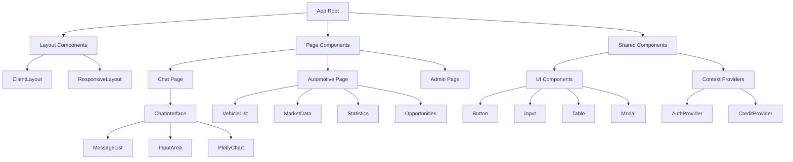
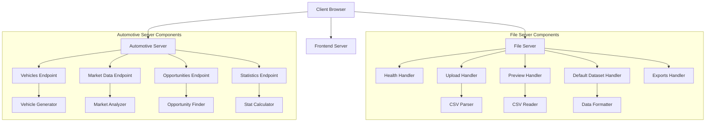
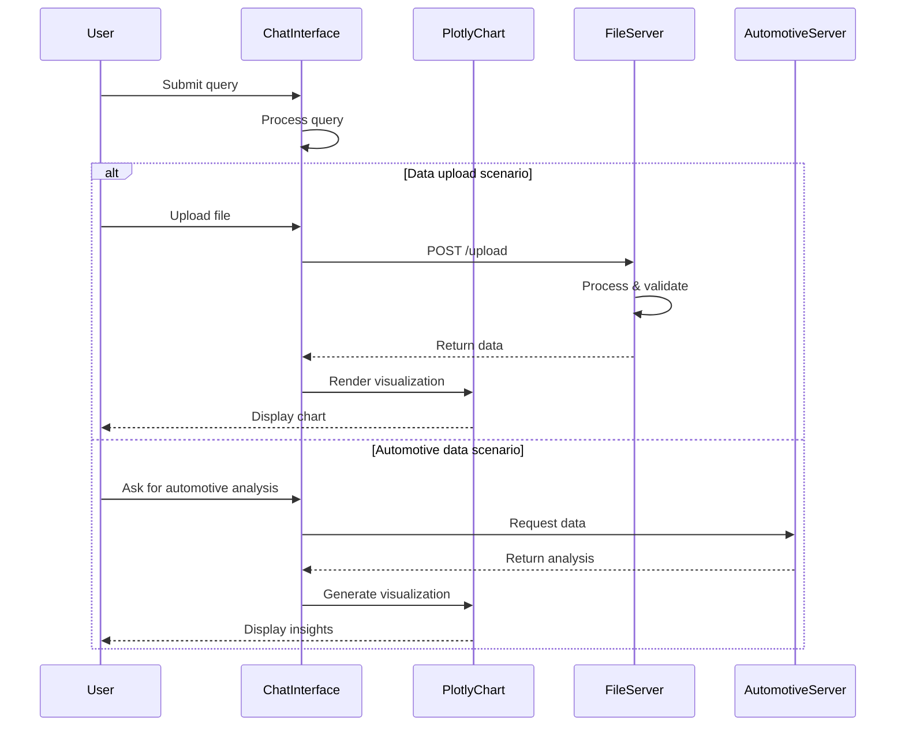
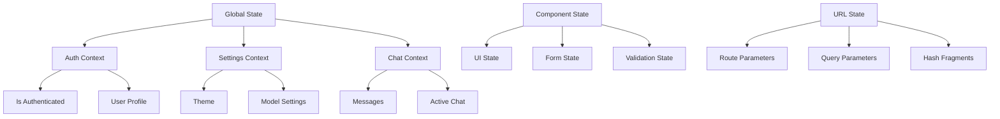

# Auto-Analyst Component Structure

This document provides a detailed overview of the component structure in the Auto-Analyst application, covering both frontend and backend components.

## Frontend Components

The frontend is built using Next.js and follows a modular architecture with several key component categories.

### Component Hierarchy



### Key Frontend Components

#### Layout Components

- **ClientLayout**: Provides the outer layout including theme, authentication context, and global navigation
- **ResponsiveLayout**: Handles responsive layout changes for different screen sizes

#### Page Components

- **ChatPage**: Main page for data analysis chat interface
- **AutomotivePage**: Dashboard for automotive data analysis
- **AdminPage**: Administrative interface for user management

#### Chat Components

- **ChatInterface**: Main component managing chat interactions and state
- **MessageList**: Displays the chat history and handles message rendering
- **InputArea**: User input area with message submission and upload controls
- **PlotlyChart**: Renders Plotly visualizations from chat responses

#### Automotive Components

- **VehicleList**: Displays and manages vehicle inventory data
- **MarketData**: Shows market pricing analysis and comparisons
- **Statistics**: Renders statistical insights about inventory and market
- **Opportunities**: Displays potential profit opportunities

#### UI Components

- **Button**: Styled button component with variants
- **Input**: Form input component with validation
- **Table**: Data table with sorting and filtering
- **Modal**: Dialog component for confirmations and alerts

#### Context Providers

- **AuthProvider**: Manages authentication state
- **CreditProvider**: Handles user credit management for API usage

## Backend Components

The backend consists of several Python services that handle different aspects of the application.

### Service Architecture



### Key Backend Components

#### File Server Components

- **HealthHandler**: Provides server health status
- **UploadHandler**: Processes file uploads with validation
- **PreviewHandler**: Generates data previews from CSV files
- **DefaultDatasetHandler**: Serves the default dataset
- **ExportsHandler**: Handles file serving from the exports directory

- **CSVParser**: Parses and validates CSV files
- **CSVReader**: Reads and extracts data from CSV files
- **DataFormatter**: Formats data for API responses

#### Automotive Server Components

- **VehiclesEndpoint**: Serves vehicle inventory data
- **MarketDataEndpoint**: Provides market pricing analysis
- **OpportunitiesEndpoint**: Calculates pricing opportunities
- **StatisticsEndpoint**: Generates statistical summaries

- **VehicleGenerator**: Creates vehicle data models
- **MarketAnalyzer**: Analyzes market pricing and trends
- **OpportunityFinder**: Identifies potential profit opportunities
- **StatCalculator**: Calculates statistical metrics

## Component Interactions

The following diagram shows how the key components interact with each other:



## Component Details

### ChatInterface Component

The ChatInterface is one of the most complex components in the system:

```typescript
interface PlotlyMessage {
  type: "plotly";
  data: any[];
  layout: {
    title?: string;
    xaxis?: {
      title?: string;
    };
    yaxis?: {
      title?: string;
    };
    [key: string]: any;
  };
}

interface Message {
  text: string | PlotlyMessage;
  sender: "user" | "ai";
}

const ChatInterface: React.FC = () => {
  // State management
  const [messages, setMessages] = useState<Message[]>([]);
  const [loading, setLoading] = useState<boolean>(false);
  const [inputText, setInputText] = useState<string>('');
  
  // Functions for handling messages
  const handleSendMessage = async (message: string) => {
    // Implementation details
  };
  
  const handleFileUpload = async (file: File) => {
    // Implementation details
  };
  
  // Render the interface
  return (
    <div className="chat-container">
      {/* Component JSX */}
    </div>
  );
};
```

### File Server Handler

The file server uses a request handler pattern:

```python
class CustomHandler(http.server.SimpleHTTPRequestHandler):
    def do_OPTIONS(self):
        # Handle CORS preflight requests
        
    def do_GET(self):
        # Route GET requests to appropriate handlers
        
    def do_POST(self):
        # Route POST requests to appropriate handlers
        
    def handle_upload(self):
        # Process file uploads
        
    def handle_default_dataset(self):
        # Serve the default dataset
        
    # Additional handler methods
```

### Automotive API Endpoints

The automotive server provides several API endpoints:

```python
def generate_vehicles(count=50):
    # Generate vehicle data
    
def generate_market_data(vehicles):
    # Generate market analysis based on vehicles
    
def generate_opportunities(vehicles, market_data):
    # Identify price opportunities
    
def generate_statistics(vehicles, market_data):
    # Calculate statistics
    
class AutomotiveHandler(http.server.BaseHTTPRequestHandler):
    def do_GET(self):
        # Route requests based on path
```

## Frontend State Management

The frontend employs several state management approaches:

1. **Local Component State**: For component-specific UI state
2. **React Context**: For global state like authentication and user preferences
3. **URL State**: For preserving user navigation and sharable states



## Backend Data Models

The backend uses several key data models:

### Vehicle Model

```python
{
    "id": 1,
    "make": "Toyota",
    "model": "Camry",
    "year": 2021,
    "color": "Black",
    "price": 28500.00,
    "mileage": 32000,
    "condition": "Excellent",
    "fuel_type": "Gasoline",
    "days_in_inventory": 45,
    "vin": "1NXBR30E87Z123456",
    "is_sold": False
}
```

### Market Data Model

```python
{
    "id": 1,
    "make": "Toyota",
    "model": "Camry",
    "year": 2021,
    "your_price": 28500.00,
    "market_price": 30200.00,
    "price_difference": -1700.00,
    "price_difference_percent": -5.63,
    "days_in_inventory": 45,
    "market_demand": "High",
    "avg_days_to_sell": 30
}
```

## Component Communication

Components communicate through several mechanisms:

1. **Props**: For parent-child communication
2. **Callbacks**: For child-parent communication
3. **Context**: For cross-component communication
4. **HTTP Requests**: For client-server communication

## Development Guidelines

When working with the component structure, follow these guidelines:

1. **Component Responsibility**: Each component should have a single responsibility.
2. **Reusability**: Create reusable components for consistent UI elements.
3. **State Management**: Use local state for UI-specific state, context for global state.
4. **Error Handling**: Implement error boundaries around complex components.
5. **Props Interface**: Define clear TypeScript interfaces for component props.
6. **Responsive Design**: Ensure components work across different screen sizes.
7. **Accessibility**: Follow accessibility best practices in UI components.

## Adding New Components

To add a new component:

1. Identify the component's purpose and responsibility
2. Choose the appropriate location in the component hierarchy
3. Create the component with proper TypeScript typing
4. Implement the component's functionality
5. Add appropriate error handling
6. Test the component in isolation and integration
7. Document the component's purpose and API 