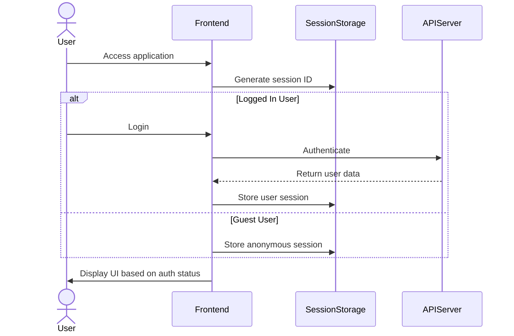
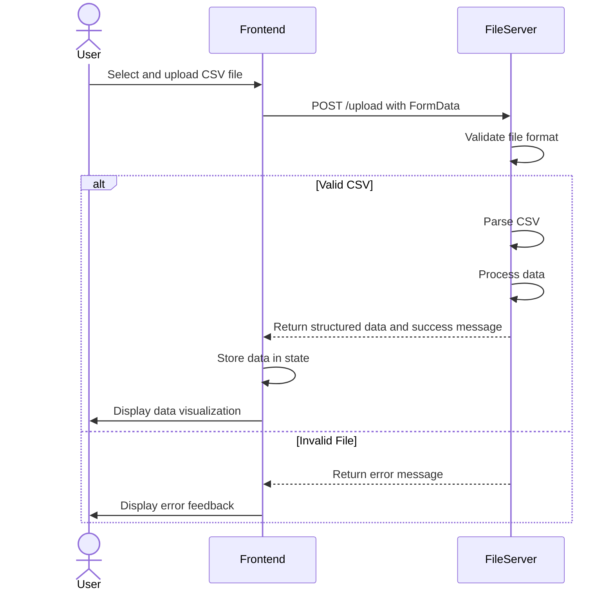
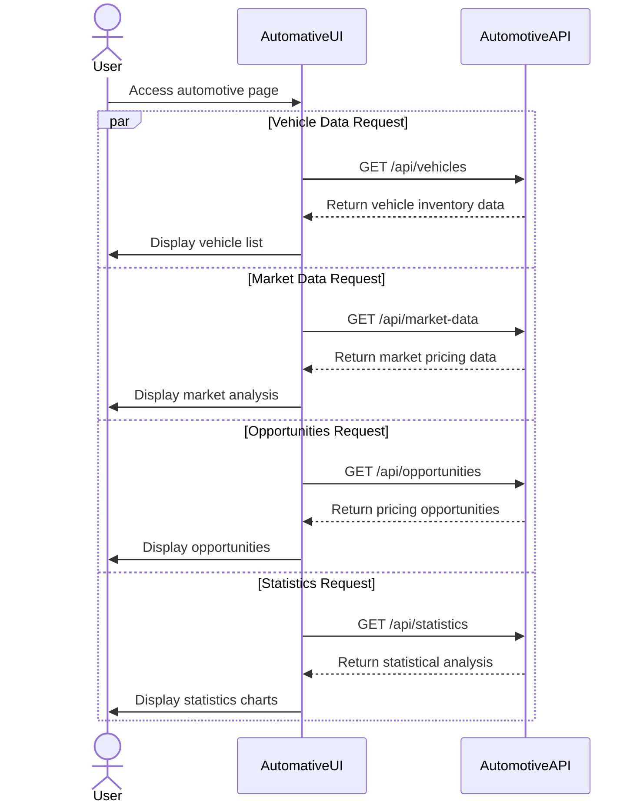
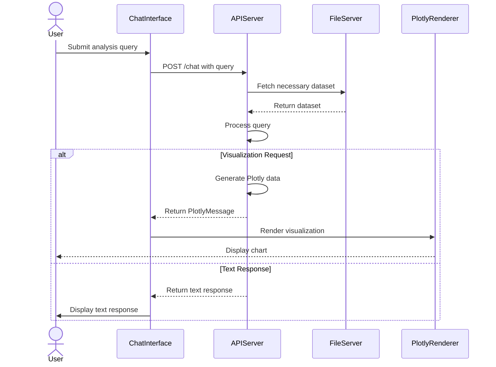
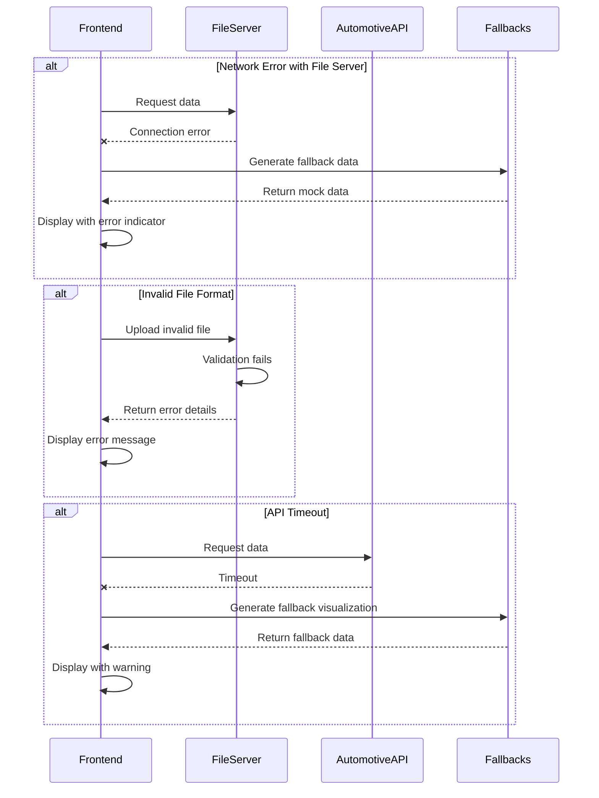
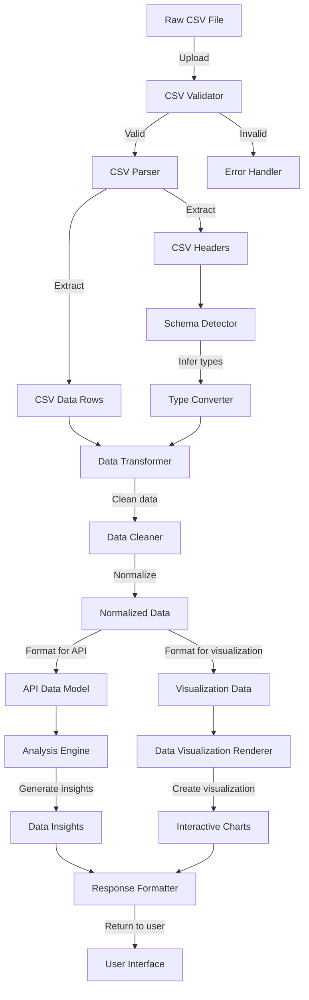
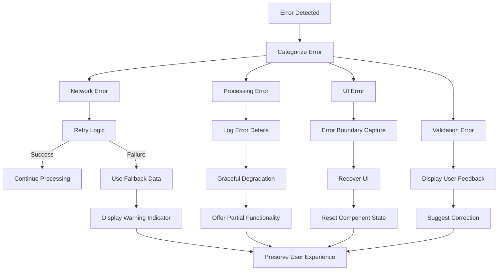

# Auto-Analyst Data Flow

This document details the data flow through the Auto-Analyst system, showing how information is processed, transformed, and displayed.

## System Overview

The Auto-Analyst application has three main services:

1. **Frontend (Next.js)** - Runs on port 3000
2. **File Server (Python)** - Runs on port 8001
3. **Automotive API (Python)** - Runs on port 8003

## Core Data Flows

### 1. User Authentication and Session Flow

### 2. File Upload and Processing Flow

### 3. Automotive Data Query Flow

### 4. Chat Interface Data Flow

### 5. Error Handling and Fallback Flow

## Data Transformation Process

## Key API Interactions

### File Server API

| Endpoint | Method | Description | Request Format | Response Format |
|----------|--------|-------------|----------------|-----------------|
| `/upload` | POST | Upload CSV file | FormData with file | JSON with parsed data |
| `/exports/<filename>` | GET | Download file | URL path | File content |
| `/api/default-dataset` | GET | Get default data | N/A | JSON with dataset |
| `/health` | GET | Health check | N/A | JSON status |

### Automotive API

| Endpoint | Method | Description | Request Format | Response Format |
|----------|--------|-------------|----------------|-----------------|
| `/api/vehicles` | GET | Get vehicle inventory | Query parameters | JSON array of vehicles |
| `/api/market-data` | GET | Get market pricing | Query parameters | JSON array of market data |
| `/api/opportunities` | GET | Get pricing opportunities | Query parameters | JSON array of opportunities |
| `/api/statistics` | GET | Get statistics | Query parameters | JSON with statistics |
| `/health` | GET | Health check | N/A | JSON status |

## Data Storage

The system primarily uses in-memory storage and file-based storage:

1. **Frontend State**: React state and context for UI data
2. **File Server**: Stores CSV files in the `/exports` directory
3. **Local Storage**: Used for user preferences and session information

## Error Handling Strategy

The system implements multiple layers of error handling:

## Performance Considerations

1. **Data Pagination**: Large datasets are paginated to improve rendering performance
2. **Lazy Loading**: Components and visualizations are loaded on demand
3. **Data Caching**: Frequently accessed data is cached in memory
4. **Throttled API Calls**: Requests to the same endpoint are throttled to prevent overloading

## Future Enhancements

1. **Real-time Updates**: Implement WebSocket connections for live data updates
2. **Database Integration**: Add persistent storage with a proper database
3. **Advanced Caching**: Implement Redis or similar for distributed caching
4. **Microservice Architecture**: Further decompose services for better scalability 